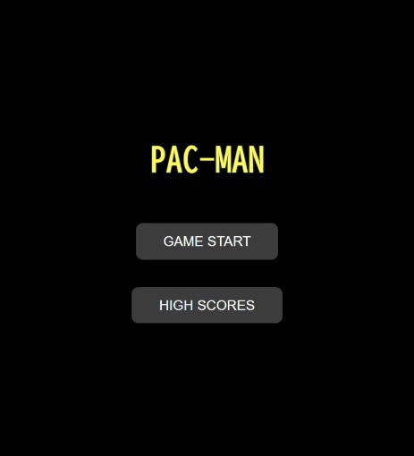

# PAC-MAN Java版
ナムコのアーケードゲーム「パックマン」をSpring Bootを使用して再現してみました。

 


## 概要
- **ゴーストに触れずにすべてのエサを食べると次のラウンドへ**
- **パワーエサを食べるとゴーストがイジケ状態になり、一定時間食べることが可能**
- **一定数のエサを食べるとフルーツが出現**
- **サウンドエフェクト & BGM**
- **ランダムに移動するゴースト**
- **1UPシステム(ボーナススコアでライフが1追加)**
- **ゲームオーバー後にスペースキーを押すとタイトル画面に戻ります。**

## 🎮 操作方法
| アクション | 操作キー |
|------------|---------|
| **上に移動** | ↑(上キー) |
| **下に移動** | ↓(下キー) |
| **左に移動** | ←(左キー) |
| **右に移動** | →(右キー) |

## スコア表
| アイテム | スコア |
|------------|---------|
| **エサ** | 10 pts |
| **パワーエサ** | 50 pts |
| **フルーツ** | 100 pts |
| **ゴースト(イジケ状態)** | 200 pts |

## 🛠️ 技術スタック
- **バックエンド**
  - Java 25 (Java 17+)
  - Spring Boot 3.x
  - REST API (スコア保存)
- **フロントエンド**
  - HTML / CSS
  - JavaScript

## 🚀 実行方法

1. **Javaをインストール**
   
   Java Development Kit(JDK)をインストールしてください。
   
   (最新版のJDKを推奨)

2. **リポジトリのクローン(ダウンロード)**
   
   ```sh
   git clone https://github.com/motomasMINO/Pacman-Java.git

   cd Pacman-Java

3. **アプリ起動**
   ```bash
   mvnw spring-boot:run
   ```

4. **ブラウザでアクセス**
   ```arduino
   http://localhost:8080
   ```

## 📜 ライセンス

このプロジェクトはMIT Licenseのもとで公開されています。

## 📧 お問い合わせ

- **GitHub: motomasMINO**

- **Email: yu120615@gmail.com**

  バグ報告や改善点・機能追加の提案はPull RequestまたはIssueで受け付けています!
